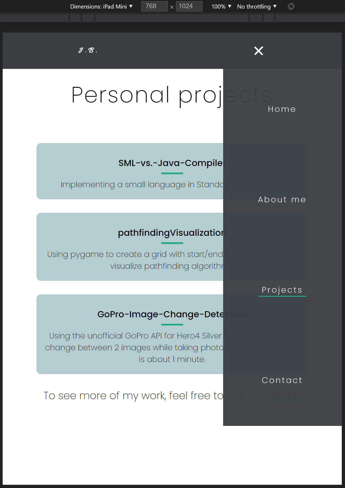

# Django Portfolio

A portfolio template using html/css/js in the frontend and Django as the backend framework. \
Cool features:
+ smooth scrolling
+ responsive design (for Desktop and mobile)
+ send an email to my GoogleMail account

---

## How to run the server
+ Create a virtual environment
    ```bash
    py -3.9 -m virtualenv <name>    # install virtualenv support

    ./<name>/Scripts/activate       # activate the virtual env
    ```
+ Install all required libraries
    ```bash
    # make sure the virtualenv is activated
    pip install -r ./requirements.txt
    ```
+ Run the Django server
    ```bash
    python manage.py runserver
    ```

---

## Important side note
+ In order to get the GoogleMail contact form to work, read the section "Setup Gmail" in following article: \
    https://martinfritz.medium.com/create-contact-form-and-send-emails-to-your-gmail-account-using-django-86ac6f739a86
+ If you want to deploy: \
  https://docs.djangoproject.com/en/3.2/howto/deployment/checklist/

---

## Screenshots (not the real resolution)



